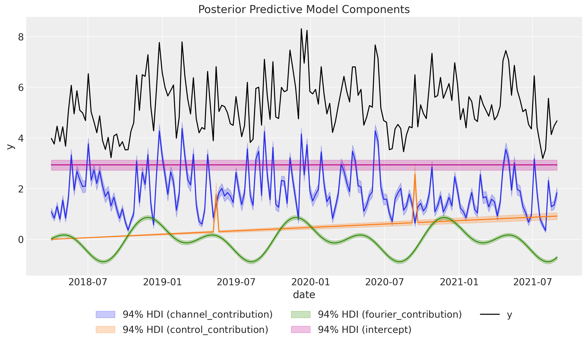
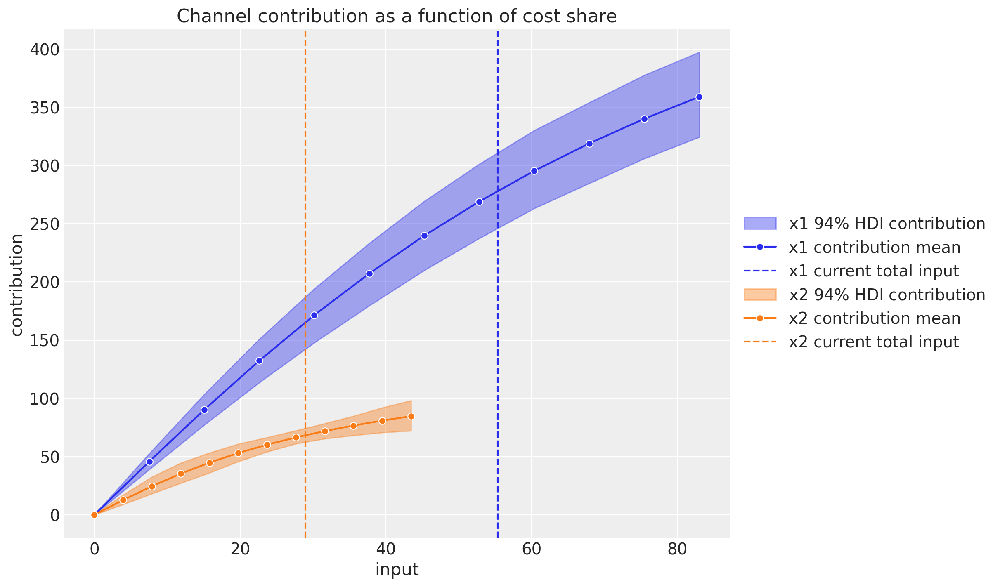
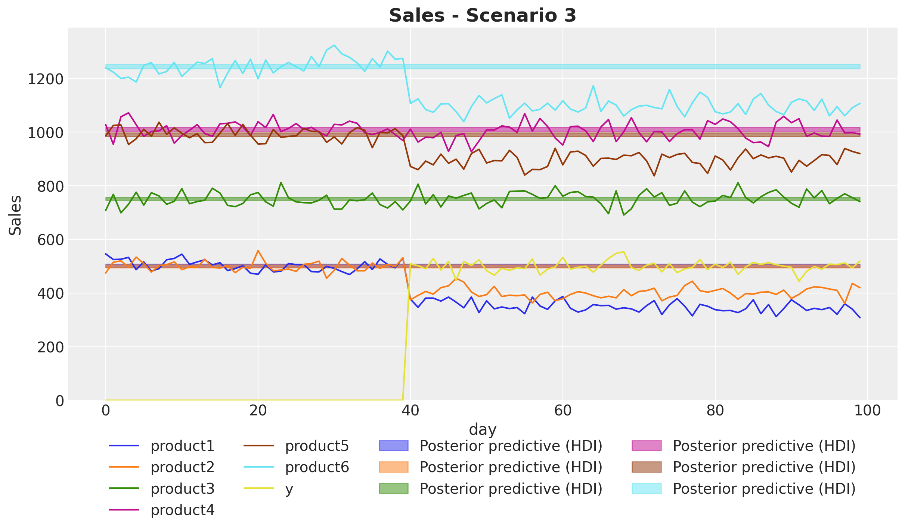
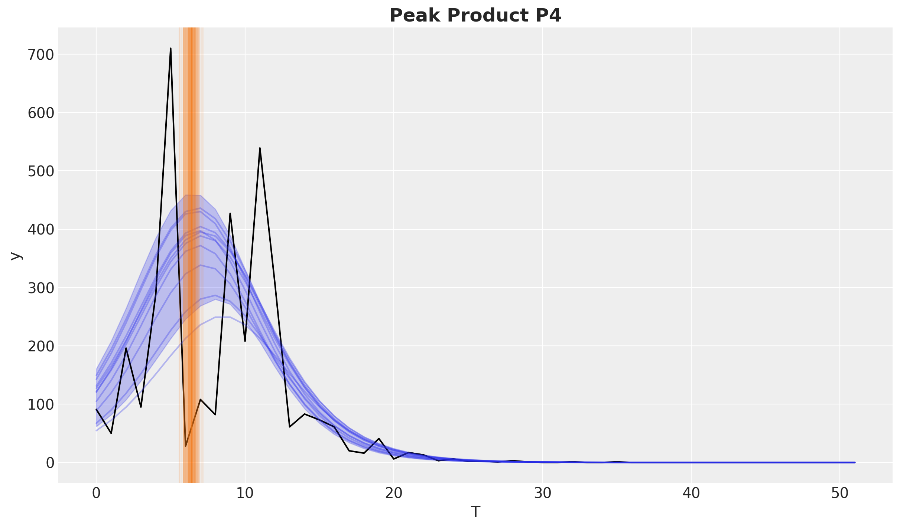

<div align="center">


</div>

----


[](https://codecov.io/gh/pymc-labs/pymc-marketing)
[](https://github.com/astral-sh/ruff)
[](https://www.pymc-marketing.io/en/latest/)

[](https://pypi.python.org/pypi/pymc-marketing)
[](https://opensource.org/licenses/Apache-2.0)

[](https://pepy.tech/project/pymc-marketing)
[](https://pepy.tech/project/pymc-marketing)
[](https://pepy.tech/project/pymc-marketing)

# PyMC-Marketing

以 [PyMC-Marketing](https://github.com/pymc-labs/pymc-marketing) 為核心，記錄用 AI 開發流程打造 MMM 互動 Demo 的完整實驗歷程。

**<a href="https://pymc-marketing-mmm.streamlit.app/" target="_blank">📊 mmm-demo 線上體驗</a>** · **<a href="https://jacobhsu.github.io/pymc-marketing-mmm/" target="_blank">💻 slidev 簡報</a>**

---

## mmm-demo

以 PyMC-Marketing 為模型核心，Streamlit 為前端框架打造的 MMM 互動展示 App。支援完整工作流程：載入行銷資料 → 擬合貝葉斯模型 → 分析通路 ROAS → 預算最佳化。

| | |
|---|---|
| 線上版本 | https://pymc-marketing-mmm.streamlit.app/ |
| 本地啟動 | `.\streamlit\mmm-demo\run.ps1` |
| 詳細說明 | [streamlit/mmm-demo/README.zh-TW.md](./streamlit/mmm-demo/README.zh-TW.md) |

---

## PyMC-Marketing 開源工具文件

以下為 PyMC-Marketing 原始文件（繁體中文翻譯）。

## 來自 [PyMC Labs](https://www.pymc-labs.com) 的行銷分析工具

使用 PyMC-Marketing，解鎖**媒體組合建模 (MMM)**、**顧客終身價值 (CLV)** 與**顧客選擇分析 (CSA)** 的強大潛力。這款開源行銷分析工具協助企業做出更聰明的數據驅動決策，最大化行銷活動的投資報酬率 (ROI)。

本儲存庫由 [PyMC Labs](https://www.pymc-labs.com) 維護支持。

<center>
    
</center>

對於希望將 PyMC-Marketing 整合到營運框架中的企業，[PyMC Labs](https://www.pymc-labs.com) 提供專業諮詢與培訓服務。我們的團隊精通最先進的貝葉斯建模技術，專注於媒體組合模型 (MMM) 與顧客終身價值 (CLV)。詳情請參閱[這裡](README.md#-schedule-a-free-consultation-for-mmm--clv-strategy)。

歡迎觀看我們的影片：[貝葉斯行銷組合模型：最新進展](https://www.youtube.com/watch?v=xVx91prC81g)，深入了解相關主題。

### 社群資源

- [PyMC-Marketing 討論區](https://github.com/pymc-labs/pymc-marketing/discussions)
- [PyMC Discourse 論壇](https://discourse.pymc.io/)
- [Bayesian Discord 伺服器](https://discord.gg/swztKRaVKe)
- [MMM Hub Slack](https://www.mmmhub.org/slack)

## 快速安裝指南

透過 conda-forge 建立專屬 Python 環境 `marketing_env`，即可開始使用 PyMC-Marketing：

```bash
conda create -c conda-forge -n marketing_env pymc-marketing
conda activate marketing_env
```

完整安裝說明請參閱 [PyMC 官方安裝文件](https://www.pymc.io/projects/docs/en/latest/installation.html)。

### Docker

我們提供 `Dockerfile`，可建立支援 Jupyter Notebook 的 PyMC-Marketing Docker 映像。詳情請參閱[這裡](scripts/docker/README.md)。

## PyMC 深度貝葉斯媒體組合建模 (MMM)

運用我們的貝葉斯 MMM API，精準調整您的行銷策略。我們的 API 以研究論文 [Jin, Yuxue, et al. "Bayesian methods for media mix modeling with carryover and shape effects." (2017)](https://research.google/pubs/pub46001/) 為基礎，並結合核心 PyMC 開發人員的專業知識加以擴展，提供以下功能：

| 功能 | 效益 |
| ---- | ---- |
| 自訂先驗與概似函數 | 透過先驗分佈納入領域知識，讓模型貼合您的業務需求 |
| 廣告效果衰減轉換 (Adstock) | 優化行銷渠道的延續效果 |
| 飽和效應 | 了解媒體投資的邊際遞減報酬 |
| 自訂 Adstock 與飽和函數 | 可從多種函數中選擇，甚至實作自訂函數。詳見[文件指南](https://www.pymc-marketing.io/en/stable/notebooks/mmm/mmm_components.html) |
| 時變截距 | 使用高斯過程近似方法，捕捉模型中隨時間變化的基線貢獻。詳見[指南筆記本](https://www.pymc-marketing.io/en/stable/notebooks/mmm/mmm_time_varying_media_example.html) |
| 時變媒體貢獻 | 使用高斯過程近似方法，捕捉模型中隨時間變化的媒體效益。詳見[指南筆記本](https://www.pymc-marketing.io/en/stable/notebooks/mmm/mmm_tvp_example.html) |
| 視覺化與模型診斷 | 全面檢視模型效能與洞察 |
| 因果識別 | 輸入業務驅動的有向無環圖 (DAG)，識別有意義的變數以得出因果結論。具體示例請見[指南筆記本](https://www.pymc-marketing.io/en/stable/notebooks/mmm/mmm_causal_identification.html) |
| 多種推論演算法 | 支援多種 NUTS 採樣器（如 BlackJax、NumPyro、Nutpie）。詳見[範例筆記本](https://www.pymc-marketing.io/en/stable/notebooks/general/other_nuts_samplers.html) |
| GPU 加速 | PyMC 多後端架構支援 GPU 加速運算 |
| 樣本外預測 | 含可信區間的未來行銷效能預測，可用於模擬與情境規劃 |
| 預算最佳化 | 在各渠道間有效分配行銷預算以最大化 ROI。詳見[預算最佳化範例筆記本](https://www.pymc-marketing.io/en/stable/notebooks/mmm/mmm_budget_allocation_example.html) |
| 實驗校正 | 根據實際實驗微調模型，獲得更統一的行銷視角。詳見[提升測試整合說明](https://www.pymc-marketing.io/en/stable/notebooks/mmm/mmm_lift_test.html)。另有[案例研究：未觀測混淆因子、ROAS 與提升測試](https://www.pymc-marketing.io/en/stable/notebooks/mmm/mmm_roas.html) |

### MMM 快速入門

以下程式碼片段展示如何初始化並擬合 `MMM` 模型：

```python
import pandas as pd

from pymc_marketing.mmm import (
    GeometricAdstock,
    LogisticSaturation,
)
from pymc_marketing.mmm.multidimensional import MMM
from pymc_marketing.paths import data_dir

file_path = data_dir / "mmm_example.csv"
data = pd.read_csv(file_path, parse_dates=["date_week"])

mmm = MMM(
    adstock=GeometricAdstock(l_max=8),
    saturation=LogisticSaturation(),
    date_column="date_week",
    channel_columns=["x1", "x2"],
    control_columns=[
        "event_1",
        "event_2",
        "t",
    ],
    yearly_seasonality=2,
)

X = data.drop("y", axis=1)
y = data["y"]
mmm.fit(X, y)
```

模型擬合後，可探索結果與洞察。例如，繪製各組成要素的貢獻：



可計算渠道效益並與估計的廣告花費回報率 (ROAS) 進行比較。

<center>
    
</center>

模型擬合後，由於已納入邊際遞減報酬與延續效果，可進一步最佳化預算分配。

<center>
    
</center>

- 探索[快速入門指南](https://pymc-marketing.readthedocs.io/en/stable/notebooks/mmm/mmm_quickstart.html)與更完整的[模擬範例](https://pymc-marketing.readthedocs.io/en/stable/notebooks/mmm/mmm_example.html)，深入了解 PyMC-Marketing 的 MMM。
- 從模型規格到預算分配的完整端對端分析，請參閱[指南筆記本](https://www.pymc-marketing.io/en/stable/notebooks/mmm/mmm_case_study.html)。

### 媒體組合建模 (MMM) 推薦閱讀

- [貝葉斯媒體組合建模的行銷最佳化](https://www.pymc-labs.com/blog-posts/bayesian-media-mix-modeling-for-marketing-optimization/)
- [提升貝葉斯行銷組合模型的速度與準確性](https://www.pymc-labs.com/blog-posts/reducing-customer-acquisition-costs-how-we-helped-optimizing-hellofreshs-marketing-budget/)
- [Johns, Michael and Wang, Zhenyu. "A Bayesian Approach to Media Mix Modeling"](https://www.youtube.com/watch?v=UznM_-_760Y)
- [Orduz, Juan. "Media Effect Estimation with PyMC: Adstock, Saturation & Diminishing Returns"](https://juanitorduz.github.io/pymc_mmm/)
- [貝葉斯行銷組合建模完整指南](https://1749.io/learn/f/a-comprehensive-guide-to-bayesian-marketing-mix-modeling)

### 互動應用程式：MMM 概念的 Streamlit App

動態互動式視覺化 MMM 核心概念，包括廣告效果衰減、飽和效應與貝葉斯先驗的應用。本應用程式協助行銷人員、資料科學家及所有對 MMM 有興趣的人更深入理解相關概念。

**[點此查看應用程式](https://pymc-marketing-app.streamlit.app/)**

## 使用 PyMC 解鎖顧客終身價值 (CLV)

透過我們的 **CLV 模型**，深入了解並優化顧客價值。我們的 API 支援多種 CLV 模型，涵蓋合約型與非合約型情境，以及連續型與離散型交易模式。

- [CLV 快速入門](https://www.pymc-marketing.io/en/stable/notebooks/clv/clv_quickstart.html)
- [BG/NBD 模型](https://www.pymc-marketing.io/en/stable/notebooks/clv/bg_nbd.html)
- [Pareto/NBD 模型](https://www.pymc-marketing.io/en/stable/notebooks/clv/pareto_nbd.html)
- [Gamma-Gamma 模型](https://www.pymc-marketing.io/en/stable/notebooks/clv/gamma_gamma.html)
- [Shifted BG 模型](https://www.pymc-marketing.io/en/stable/notebooks/clv/sbg.html)
- [Modified BG/NBD 模型](https://www.pymc-marketing.io/en/stable/notebooks/clv/mbg_nbd.html)

### 範例情境

|  | **非合約型** | **合約型** |
| --- | --- | --- |
| **連續型** | 線上購物 | 廣告轉換時間 |
| **離散型** | 演唱會與體育賽事 | 定期訂閱服務 |

### CLV 快速入門

```python
import matplotlib.pyplot as plt
import pandas as pd
import seaborn as sns
from pymc_marketing import clv
from pymc_marketing.paths import data_dir

file_path = data_dir / "clv_quickstart.csv"
data = pd.read_csv(data_path)
data["customer_id"] = data.index

beta_geo_model = clv.BetaGeoModel(data=data)

beta_geo_model.fit()
```

模型擬合後，可用於預測已知顧客的未來購買次數、仍然活躍的概率，並生成各種視覺化圖表。


更多內容請參閱範例章節。

## 使用 PyMC-Marketing 進行顧客選擇分析

透過**多變量間斷時間序列 (MVITS)** 模型，分析新產品上市的影響並了解顧客選擇行為。我們的 API 支援飽和市場與非飽和市場分析，協助您：

| 功能 | 效益 |
| ---- | ---- |
| 市占率分析 | 了解新產品如何影響現有產品的市占率 |
| 因果影響評估 | 衡量產品上市對銷售的真實因果效應 |
| 飽和市場分析 | 建模市場總規模維持不變的情境 |
| 非飽和市場分析 | 處理新產品擴大市場總規模的情況 |
| 視覺化工具 | 繪製市占率、因果影響與反事實圖表 |
| 貝葉斯推論 | 取得所有預測的不確定性估計 |

### 顧客選擇快速入門

```python
import pandas as pd
from pymc_marketing.customer_choice import MVITS, plot_product

# 定義現有產品
existing_products = ["competitor", "own"]

# 建立 MVITS 模型
mvits = MVITS(
    existing_sales=existing_products,
    saturated_market=True,  # 非飽和市場設為 False
)

# 擬合模型
mvits.fit(X, y)

# 繪製市占率因果影響
mvits.plot_causal_impact_market_share()

# 繪製反事實
mvits.plot_counterfactual()
```

<center>
    
</center>

請參閱[飽和市場](https://www.pymc-marketing.io/en/stable/notebooks/customer_choice/mv_its_saturated.html)與[非飽和市場](https://www.pymc-marketing.io/en/stable/notebooks/customer_choice/mv_its_unsaturated.html)的範例筆記本，深入了解 PyMC-Marketing 的顧客選擇建模。

## Bass 擴散模型

Bass 擴散模型是預測新產品採用情況的熱門模型，屬於產品生命週期模型的一種，將新產品的市場滲透率描述為時間的函數。PyMC-Marketing 提供靈活的 Bass 擴散模型實作，可自訂模型參數並擬合到您的特定資料（支援多產品）。

<center>
    
</center>

## 離散選擇模型

離散選擇模型有多種形式，但都旨在說明如何將在一組替代方案中的選擇理解為各替代方案可觀測屬性的函數。這類建模可深入了解產品的「必備」特性，並可用於評估產品上市或重新上市的成敗。PyMC-Marketing 的實作提供基於公式的模型規格，用於估計市場中各商品的相對效用並識別最重要的特性。

<center>
    
</center>

## 為何選擇 PyMC-Marketing？

PyMC-Marketing 採用 [Apache 2.0](LICENSE) 授權，永久免費供商業使用。由廣受歡迎的 PyMC 套件核心開發人員與行銷專家共同打造，為行銷團隊提供最先進的衡量與分析能力。

由於其開源特性與活躍的貢獻者社群，新功能持續不斷地加入。您是否缺少某項功能，或想要貢獻？歡迎 Fork 我們的儲存庫並提交 Pull Request。如有任何問題，歡迎[開啟 Issue](https://github.com/pymc-labs/pymc-marketing/issues)。

### 感謝所有貢獻者！

[](https://github.com/pymc-labs/pymc-marketing/graphs/contributors)

## 行銷 AI 助理：MMM-GPT with PyMC-Marketing

不知從何開始，或有任何問題？MMM-GPT 是一款 AI 助理，可針對使用 PyMC-Marketing 的行銷分析問題提供解答與專業建議。

**[立即試用 MMM-GPT](https://mmm-gpt.com/)**

## 📞 預約 MMM & CLV 策略免費諮詢

透過與 PyMC-Marketing 專家的[免費 30 分鐘策略諮詢](https://calendly.com/niall-oulton)，最大化您的行銷 ROI。了解貝葉斯媒體組合建模與顧客終身價值分析如何透過更聰明的數據驅動決策，提升您的組織效能。

我們提供以下專業服務：

- **客製化模型**：為您的組織獨特需求量身打造專業行銷分析模型。
- **在 PyMC-Marketing 內建構**：我們的團隊成員擅長運用 PyMC-Marketing 的功能，為精準洞察建立穩健的行銷模型。
- **SLA 與教練輔導**：提供有保障的服務等級協議與個人化輔導，確保您的團隊能熟練自信地使用我們的工具與方法。
- **SaaS 解決方案**：運用我們頂尖的軟體解決方案，簡化您的數據驅動行銷計畫。
